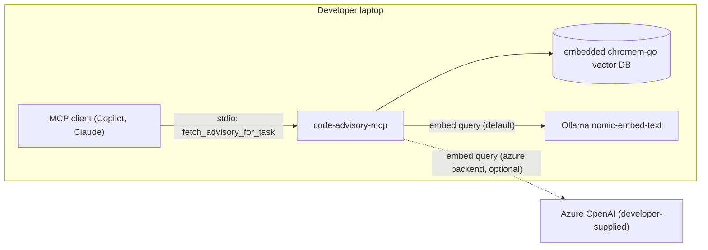

```mermaid
flowchart LR
  subgraph laptop["Developer laptop"]
    client["MCP client (Copilot, Claude)"] -->|"stdio: fetch_advisory_for_task"| code-advisory-mcp
    code-advisory-mcp --> db[(embedded chromem-go vector DB)]
    code-advisory-mcp -->|"embed query (default)"| ollama["Ollama nomic-embed-text"]
  end
  code-advisory-mcp -.->|"embed query (azure backend, optional)"| aoai["Azure OpenAI (developer-supplied)"]
```
